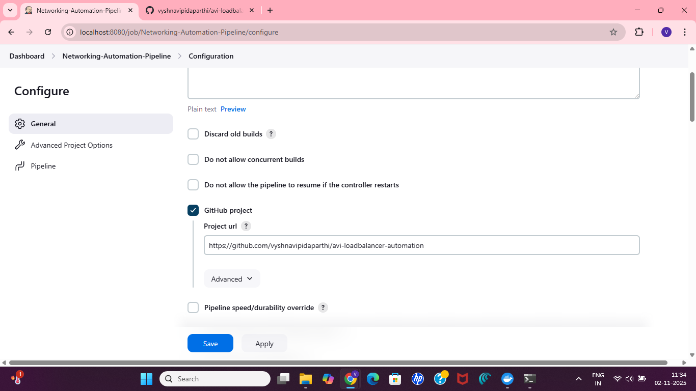
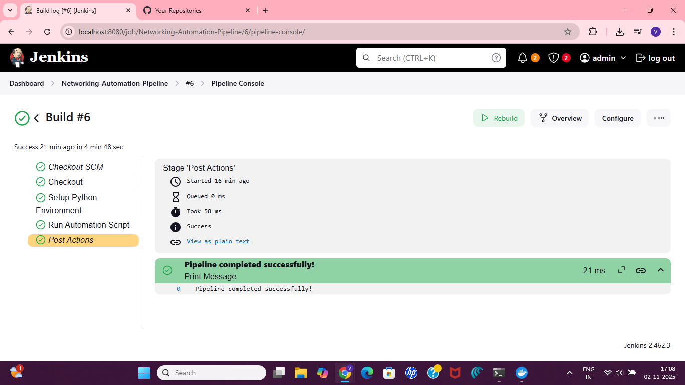
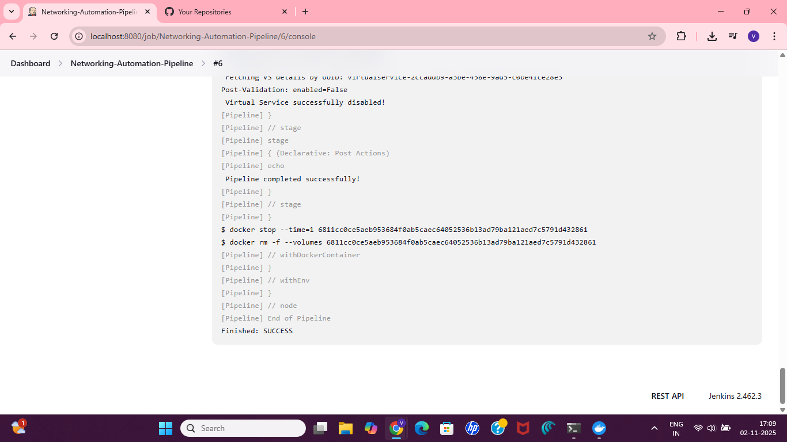

# 🚀 Avi Load Balancer Mock API Automation Framework with Jenkins CI/CD

## 📘 Overview
A lightweight Python automation framework integrated with a **Jenkins CI/CD pipeline**.  
It interacts with a **Mock Avi Load Balancer API** to automate API workflows such as authentication, fetching virtual services, disabling a target service, and verifying results.  

This updated version includes a **Dockerized Jenkins setup** that automatically executes the automation framework whenever changes are pushed to GitHub.

---

## 🧩 Features
- Modular Python structure (API handler, test runner, mocks)
- YAML-based configuration
- Parallel test execution (multi-threading)
- Mock SSH and RDP components
- Console and file logging
- Jenkins pipeline automation
- Docker-based CI/CD environment

---

## ⚙️ Requirements
- **Python 3.8+**
- **Docker Desktop** (with WSL2 backend enabled)
- **Jenkins (Docker container)**  
- **Internet connection**
- Python packages from `requirements.txt`

Install dependencies manually (if running locally):
```bash
pip install -r requirements.txt
````

---

## 🧱 Configuration

Edit **`config.yaml`** with your API credentials and target service details:

```yaml
api:
  base_url: "https://avi-mock-api-production.up.railway.app"
  username: "<your_username>"
  password: "<your_password>"
  target_vs_name: "backend-vs-t1r_1000-1"

tests:
  parallel: true
  num_threads: 2
```

---

## 📁 Folder Structure

```
avi-loadbalancer-automation/
├── main.py
├── config.yaml
├── requirements.txt
├── Jenkinsfile
├── logs/
│   └── output.log
├── framework/
│   ├── api_handler.py
│   ├── test_runner.py
│   └── mocks.py
└── screenshots/
    ├── jenkins_creation1.png
    ├── pipeline_success.png
    ├── console_output.png
```

---

## 🧰 Jenkins Setup Guide

### 1️⃣ Run Jenkins in Docker

```bash
docker run -d \
  --name jenkins \
  -p 8080:8080 -p 50000:50000 \
  -v jenkins_home:/var/jenkins_home \
  -v /var/run/docker.sock:/var/run/docker.sock \
  -v "C:\Program Files\Docker\Docker\resources\bin\docker.exe:/usr/bin/docker" \
  jenkins/jenkins:lts-jdk11
```

Access Jenkins at:
👉 [http://localhost:8080](http://localhost:8080)

---

### 2️⃣ Required Jenkins Plugins

Install these plugins before running your pipeline:

| Plugin                    | Purpose                                          |
| ------------------------- | ------------------------------------------------ |
| **Pipeline: Declarative** | Defines Jenkins pipeline syntax                  |
| **Docker Pipeline**       | Enables building/running containers              |
| **Docker Commons**        | Provides Docker shared utilities                 |
| **Docker API**            | Allows Jenkins to communicate with Docker daemon |
| **Git**                   | SCM integration to pull code from GitHub         |

---

### 3️⃣ Jenkins Job Configuration

1. Go to **Dashboard → New Item → Pipeline**
2. Enter your project name (e.g., `Networking-Automation-Pipeline`)
3. Under **Pipeline → Definition**, select **Pipeline script from SCM**
4. Choose **Git** and paste your repo URL:

   ```
   https://github.com/vyshnavipidaparthi/avi-loadbalancer-automation.git
   ```
5. Save and Build the project.

---

## 🔁 Jenkins Pipeline Stages

1. **Checkout SCM** – Clones the GitHub repo.
2. **Setup Python Environment** – Creates virtual environment or Docker container with Python 3.13.
3. **Run Automation Script** – Executes `main.py` using the configuration file.
4. **Post Actions** – Displays success/failure messages in console and logs.

---

## 🖼️ Screenshots

### 🧩 Jenkins Job Configuration



### ✅ Successful Pipeline Execution (All Green Stages)



### 🧾 Console Output – “Run Automation” Stage



---

## 🧪 Example Console Output

```
[Pipeline] Start of Pipeline
Running on Jenkins
+ docker pull python:3.13
3.13: Pull complete
+ python3 main.py
✅ Login successful
📡 Fetching Virtual Services...
⚙️ Updating VS → enabled=False
✅ Virtual Service successfully disabled!
Finished: SUCCESS
```

---

## 🎯 Results

* End-to-end CI/CD pipeline fully functional.
* Automation script runs automatically via Jenkins pipeline.
* Demonstrates practical DevOps workflow using **Python + Docker + Jenkins + GitHub**.


Would you like me to format this README with **your real screenshot filenames** (if you tell me what they are named on your system) so that all image links display properly on GitHub?
